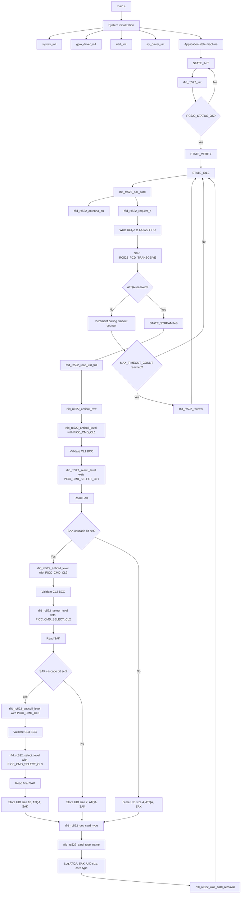

# STM32 RFID RC522 Driver Documentation


Firmware project for an STM32F407 board using an MFRC522 / RC522 RFID reader over SPI. The current focus of the project is the `rfid_rc522` driver: card polling, ISO/IEC 14443-A request and anticollision, UID extraction, SAK-based card type detection, and UART runtime logging.

## Features

- Bare-metal STM32F407 firmware based on `libopencm3`.
- MFRC522 communication over SPI2.
- RC522 register read/write helpers.
- RF antenna enable/disable and recovery handling.
- ISO/IEC 14443-A `REQA` polling.
- ATQA retrieval during card detection.
- Anticollision support for cascade levels CL1, CL2, and CL3.
- UID support for 4-byte, 7-byte, and 10-byte cards.
- BCC validation for UID frames.
- ISO14443-A `SELECT` command with CRC_A calculation through the MFRC522.
- SAK retrieval and card type classification.
- UART logs for detected card metadata.

## Hardware Setup

### Target Hardware

- MCU board: STM32F407 / STM32F407VG-Discovery class target.
- RFID reader: MFRC522 / RC522 module.
- Firmware framework: `libopencm3`.
- Debug/flash tool: OpenOCD.
- Toolchain: `arm-none-eabi-gcc`.

### Pin Mapping

| Function | STM32 Pin | Peripheral | Notes |
| --- | --- | --- | --- |
| RC522 SCK | PB10 | SPI2 SCK | Alternate function AF5 |
| RC522 MISO | PC2 | SPI2 MISO | Alternate function AF5, pull-up |
| RC522 MOSI | PC3 | SPI2 MOSI | Alternate function AF5, pull-up |
| RC522 CS / NSS | PB4 | GPIO output | Software-controlled chip select |
| RC522 RST | PB5 | GPIO output | RC522 reset pin |
| UART TX | PA2 | USART2 TX | Runtime logs |
| UART RX | PA3 | USART2 RX | Runtime logs |

### SPI Configuration

The RC522 is connected to SPI2 with the following configuration:

- Master mode.
- Full duplex, 2-line SPI.
- 8-bit data frame.
- MSB first.
- SPI mode 0: `CPOL = 0`, `CPHA = 0`.
- Software NSS using PB4.
- Prescaler: `FPCLK / 32`.
- Approximate SCK: `16 MHz / 32 = 500 kHz` when PCLK1 is 16 MHz.

## Development Environment

The project is primarily developed and validated on Linux with a Unix-like shell environment. The firmware build system is based on a Makefile and the GNU Arm embedded toolchain.

### Required Tools

- `git` with submodule support.
- `make`.
- `arm-none-eabi-gcc`.
- `arm-none-eabi-objcopy`.
- `arm-none-eabi-objdump`.
- `arm-none-eabi-size`.
- `gdb-multiarch`.
- `openocd`.
- Python, required by the `libopencm3` build flow.

### Source Dependencies

The project uses `libopencm3` as a Git submodule under:

```text
Drivers/libopencm3
```

After cloning the repository, initialize submodules with:

```bash
git submodule update --init --recursive
```

The firmware Makefile expects the `libopencm3` headers and library to be available from that location.

### Build Commands

Build the firmware from the `firmware` directory:

```bash
cd firmware
make
```

Optional debug build:

```bash
cd firmware
make BUILD=debug
```

The generated firmware target is:

```text
stm32-rfid-rc522
```

### Flash and Debug

Flashing requires an STM32F407-compatible board, an ST-Link-compatible debug probe, and OpenOCD.

```bash
cd firmware
make flash
```

To start an OpenOCD GDB server:

```bash
cd firmware
make debug-server
```

To connect with GDB:

```bash
cd firmware
make debug
```

The debug flow uses OpenOCD on port `3333` and `gdb-multiarch` as the GDB client.

### Runtime Logging

Runtime logs are available on USART2:

- Baud rate: `115200`.
- Format: `8N1`.
- TX: PA2.
- RX: PA3.

## Software Architecture

The firmware is organized around small hardware drivers and a main state machine.

| Component | Role |
| --- | --- |
| `firmware/src/gpio.c` | Configures GPIO pins for USART2, SPI2, RC522 CS, and RC522 reset. |
| `firmware/src/spi.c` | Initializes SPI2 and provides byte transfer helpers. |
| `firmware/src/rfid_rc522.c` | Implements the RC522 driver and ISO14443-A card handling. |
| `firmware/include/rfid_rc522.h` | Public RC522 driver API, constants, status codes, and data structures. |
| `firmware/src/main.c` | Runs the application state machine and logs detected card information. |
| `firmware/include/log.h` | Logging macros used by the application and driver. |

## RC522 Driver Overview

The `rfid_rc522` driver controls the MFRC522 chip and implements the card detection path needed to identify ISO14443-A cards.

Implemented capabilities include:

- RC522 initialization and software reset.
- Register-level SPI access.
- Bit mask helpers for register fields.
- Antenna control.
- Card polling using `REQA`.
- ATQA response capture.
- Anticollision at cascade levels CL1, CL2, and CL3.
- UID frame validation using BCC.
- CRC_A calculation using the MFRC522 hardware CRC engine.
- `SELECT` command generation.
- SAK parsing.
- Card type classification.
- Card removal wait loop.
- Recovery procedure when polling appears stuck.

## Communication Protocol

There are two communication layers involved:

1. STM32 to MFRC522 over SPI.
2. MFRC522 to RFID card over the 13.56 MHz RF field using ISO/IEC 14443-A.

### SPI Register Access

The STM32 communicates with the MFRC522 by reading and writing internal RC522 registers over SPI. The driver wraps this through:

- `rfid_rc522_write_reg()`
- `rfid_rc522_read_reg()`
- `rfid_rc522_clear_bit_mask()`

These helpers are used by higher-level operations such as FIFO management, command execution, IRQ polling, antenna control, and CRC calculation.

### Tracing MOSI and MISO Signals

When debugging the RC522 SPI bus with a logic analyzer or oscilloscope, probe the following signals:

| Signal | STM32 Pin | Direction | Purpose |
| --- | --- | --- | --- |
| SCK | PB10 | STM32 -> RC522 | SPI clock generated by the STM32 master. |
| MOSI | PC3 | STM32 -> RC522 | Commands, register addresses, data bytes, and dummy bytes sent to the RC522. |
| MISO | PC2 | RC522 -> STM32 | Data returned by the RC522. |
| CS / NSS | PB4 | STM32 -> RC522 | Active-low chip select. A SPI transaction is valid while CS is low. |

Use SPI mode 0 decoding in the logic analyzer:

- `CPOL = 0`: SCK is low when idle.
- `CPHA = 0`: data is sampled on the first clock edge.
- Bit order: MSB first.
- Frame size: 8 bits.

A valid RC522 register transaction should look like this:

1. `CS` goes low.
2. The STM32 sends one address/control byte on `MOSI`.
3. The STM32 sends or clocks one data byte.
4. `CS` goes high.

Because SPI is full-duplex, `MOSI` and `MISO` are active during the same clock cycles. During a write, the driver usually ignores `MISO`. During a read, the STM32 must still transmit a dummy byte on `MOSI` to generate the clock that lets the RC522 return data on `MISO`.

### Distinguishing RC522 Register Writes and Reads

The first byte after `CS` goes low identifies whether the transaction is a register write or a register read.

The driver formats RC522 register addresses as follows:

```c
#define RC522_WRITE_ADDR(addr)  ((addr << 1) & 0x7E)
#define RC522_READ_ADDR(addr)   (((addr << 1) & 0x7E) | 0x80)
```

This means:

- Write transaction: bit 7 of the address/control byte is `0`.
- Read transaction: bit 7 of the address/control byte is `1`.
- Bits `[6:1]` contain the RC522 register address shifted left by one.
- Bit 0 is always `0`.

#### Register Write Trace

For a register write, the STM32 sends two meaningful bytes on `MOSI`:

```text
CS   : low ------------------------------------------------ high
MOSI : WRITE_ADDR(register)  value_to_write
MISO : ignored              ignored / don't care
```

Example from the driver:

```c
rfid_rc522_write_reg(dev, RC522_REG_COMMAND, RC522_PCD_IDLE);
```

Expected trace pattern:

```text
MOSI byte 1: RC522_WRITE_ADDR(RC522_REG_COMMAND)
MOSI byte 2: RC522_PCD_IDLE
MISO       : not used by the driver for this operation
```

#### Register Read Trace

For a register read, the STM32 first sends the read-formatted address, then sends a dummy byte to generate the SPI clock. The register value is sampled on `MISO` during the dummy byte transfer.

```text
CS   : low ------------------------------------------------ high
MOSI : READ_ADDR(register)   0x00 dummy byte
MISO : ignored               register_value
```

Example from the driver:

```c
uint8_t version = rfid_rc522_read_reg(dev, RC522_REG_VERSION);
```

Expected trace pattern:

```text
MOSI byte 1: RC522_READ_ADDR(RC522_REG_VERSION)
MOSI byte 2: 0x00
MISO byte 1: ignored
MISO byte 2: RC522 version register value
```

The important point is that a read is not identified by the second byte. It is identified by bit 7 of the first MOSI byte. The second MOSI byte is only a dummy transfer used to clock the response out of the RC522 on MISO.

### RC522 Register Access vs RFID Card Commands

Do not confuse RC522 register reads/writes with RFID card memory reads/writes:

- RC522 register access is the SPI protocol between the STM32 and the MFRC522 chip.
- RFID card commands are ISO14443-A / MIFARE frames transmitted by the MFRC522 through the RF antenna.

For example, when the firmware sends `REQA`, anticollision, or `SELECT`, the STM32 still writes bytes into RC522 FIFO registers over SPI. The MFRC522 then transmits those bytes over RF to the card. The card response is received by the MFRC522 and later read back by the STM32 from RC522 FIFO registers.

### ISO14443-A Detection Flow

The implemented card detection flow is:

1. Enable or keep the RC522 antenna active.
2. Send `REQA` to detect a card in the RF field.
3. Read the 2-byte ATQA response.
4. Run anticollision for cascade level 1.
5. Validate the returned UID part with BCC.
6. Send `SELECT` for the current cascade level.
7. Read SAK.
8. If SAK indicates cascade continuation, repeat with CL2 and then CL3.
9. Store the final UID size, ATQA, and SAK.
10. Classify the card type from SAK.

## UID Handling

ISO14443-A cards may expose different UID lengths:

| UID Type | Size | Cascade Levels |
| --- | ---: | --- |
| Single-size UID | 4 bytes | CL1 |
| Double-size UID | 7 bytes | CL1 + CL2 |
| Triple-size UID | 10 bytes | CL1 + CL2 + CL3 |

The driver uses the `RC522_UID` structure to store the complete result:

```c
typedef struct {
    uint8_t uid[RC522_UID_MAX_SIZE];
    uint8_t size;
    uint8_t sak;
    uint8_t atqa[2];
} RC522_UID;
```

During anticollision, each cascade level returns a 5-byte frame:

```text
UID byte 0 | UID byte 1 | UID byte 2 | UID byte 3 | BCC
```

The BCC byte is checked by XORing the UID bytes. If the check fails, the driver returns `RC522_STATUS_BCC_MISMATCH`.

For 7-byte and 10-byte UIDs, the first byte of an intermediate cascade level is the cascade tag `0x88`, indicating that the UID continues at the next cascade level.

## Card Type Detection

Card type detection is based on the SAK returned by the card after `SELECT`.

Supported card type labels include:

- `MIFARE Mini`
- `MIFARE Classic 1K`
- `MIFARE Classic 4K`
- `MIFARE Ultralight`
- `MIFARE Plus`
- `ISO 14443-4`
- `ISO 18092`
- `Not complete`
- `Unknown`

Examples:

| SAK | Typical Classification |
| --- | --- |
| `0x08` | MIFARE Classic 1K |
| `0x18` | MIFARE Classic 4K |
| `0x04` cascade bit set | UID is not complete yet |

The current 1K/4K distinction is based on SAK. The driver does not yet authenticate to the card or read memory blocks to verify the physical memory size.

## Public Driver API

Main public types:

- `MFRC522_t`: RC522 instance configuration containing CS and reset GPIO information.
- `RC522_Status`: status code returned by driver operations.
- `RC522_UID`: complete card identity result including UID, UID size, SAK, and ATQA.
- `RC522_CardType`: card type classification enum.

Main public functions:

| Function | Purpose |
| --- | --- |
| `rfid_rc522_init()` | Initializes the RC522 module. |
| `rfid_rc522_antenna_on()` | Enables the RF antenna. |
| `rfid_rc522_antenna_off()` | Disables the RF antenna. |
| `rfid_rc522_write_reg()` | Writes one RC522 register. |
| `rfid_rc522_read_reg()` | Reads one RC522 register. |
| `rfid_rc522_clear_bit_mask()` | Clears selected bits in a register. |
| `rfid_rc522_poll_card()` | Sends a polling request and returns ATQA when a card is present. |
| `rfid_rc522_request_a()` | Sends ISO14443-A `REQA`. |
| `rfid_rc522_anticoll_raw()` | Reads a raw CL1 anticollision frame. |
| `rfid_rc522_read_uid()` | Reads a legacy 4-byte UID. |
| `rfid_rc522_read_uid_full()` | Reads a complete 4/7/10-byte UID using cascade levels. |
| `rfid_rc522_get_card_type()` | Classifies a card from the UID metadata and SAK. |
| `rfid_rc522_card_type_name()` | Converts a card type enum to text. |
| `rfid_rc522_wait_card_removal()` | Waits until the card leaves the RF field. |
| `rfid_rc522_recover()` | Reinitializes/recover the RC522 after a stuck polling sequence. |

## Application State Machine

The main application runs a simple state machine:

```text
INIT -> VERIFY -> IDLE -> STREAMING -> IDLE
```

### INIT

Initializes the RC522 driver. If initialization fails, the firmware retries initialization.

### VERIFY

Transitional state currently used to move from initialization to polling.

### IDLE

Polls for a card using `rfid_rc522_poll_card()`. When a card is detected, the 2-byte ATQA response is stored and the application moves to `STREAMING`.

If repeated polling attempts fail, the firmware calls `rfid_rc522_recover()`.

### STREAMING

Reads the full UID using `rfid_rc522_read_uid_full()`, logs card metadata, waits for card removal, then returns to `IDLE`.

## Global RC522 Driver Schema

The diagram below shows how the application state machine calls the RC522 driver and how the driver moves from SPI register access to RF card communication.



### Driver Layer Responsibilities

| Layer | Main Functions | Responsibility |
| --- | --- | --- |
| Application layer | `state_init()`, `state_idle()`, `state_streaming()` | Drives the high-level card detection state machine. |
| Public RC522 API | `rfid_rc522_init()`, `rfid_rc522_poll_card()`, `rfid_rc522_read_uid_full()`, `rfid_rc522_wait_card_removal()` | Provides the main operations used by `main.c`. |
| ISO14443-A flow | `rfid_rc522_request_a()`, `rfid_rc522_anticoll_raw()`, `rfid_rc522_anticoll_level()`, `rfid_rc522_select_level()` | Sends `REQA`, performs anticollision, sends `SELECT`, and reads `SAK`. |
| Classification | `rfid_rc522_get_card_type()`, `rfid_rc522_card_type_name()` | Converts final `SAK` metadata into a human-readable card type. |
| SPI/register layer | `rfid_rc522_write_reg()`, `rfid_rc522_read_reg()`, `rfid_rc522_clear_bit_mask()` | Accesses MFRC522 registers through SPI. |

### Main Call Sequence

```text
main()
 ├─ systick_init()
 ├─ gpio_driver_init()
 ├─ uart_init()
 ├─ spi_driver_init()
 └─ state machine loop
     ├─ STATE_INIT
     │   └─ state_init()
     │       └─ rfid_rc522_init(&rfID)
     │
     ├─ STATE_IDLE
     │   └─ state_idle()
     │       └─ rfid_rc522_poll_card(&rfID, current_atqa)
     │           ├─ rfid_rc522_antenna_on(&rfID)
     │           └─ rfid_rc522_request_a(&rfID, current_atqa)
     │
     └─ STATE_STREAMING
         ├─ state_streaming()
         │   ├─ rfid_rc522_read_uid_full(&rfID, &full_uid, current_atqa)
         │   │   ├─ rfid_rc522_anticoll_raw(&rfID, rawUid)
         │   │   │   └─ rfid_rc522_anticoll_level(&rfID, PICC_CMD_CL1, rawUid)
         │   │   ├─ rfid_rc522_select_level(&rfID, PICC_CMD_SELECT_CL1, rawUid, &full_uid.sak)
         │   │   ├─ optional: rfid_rc522_anticoll_level(&rfID, PICC_CMD_CL2, rawUidCl2)
         │   │   ├─ optional: rfid_rc522_select_level(&rfID, PICC_CMD_SELECT_CL2, rawUidCl2, &full_uid.sak)
         │   │   ├─ optional: rfid_rc522_anticoll_level(&rfID, PICC_CMD_CL3, rawUidCl3)
         │   │   └─ optional: rfid_rc522_select_level(&rfID, PICC_CMD_SELECT_CL3, rawUidCl3, &full_uid.sak)
         │   ├─ rfid_rc522_get_card_type(&full_uid)
         │   └─ rfid_rc522_card_type_name(card_type)
         └─ rfid_rc522_wait_card_removal(&rfID)
```

`rfid_rc522_anticoll_level()` and `rfid_rc522_select_level()` are internal driver helpers. They are shown here to document the real internal sequence used by `rfid_rc522_read_uid_full()`.

## Error Handling

Driver functions use `RC522_Status` values:

| Status | Meaning |
| --- | --- |
| `RC522_STATUS_OK` | Operation succeeded. |
| `RC522_STATUS_ERROR` | Generic communication or driver error. |
| `RC522_STATUS_TIMEOUT` | Operation timed out. |
| `RC522_STATUS_INVALID` | Invalid response or invalid state. |
| `RC522_STATUS_BCC_MISMATCH` | Anticollision UID frame failed BCC validation. |
| `RC522_STATUS_INVALID_UID` | UID cascade sequence is invalid or unsupported. |

Timeout loops are implemented with wrap-safe tick comparisons:

```c
(systick_get_tick() - start) < timeout
```

This avoids failures when the system tick counter wraps.

## Technical Notes

### Why `CommIrqReg` Is Used for Anticollision

The anticollision implementation waits on `CommIrqReg` interrupt bits to determine when the MFRC522 transceive operation is complete or has failed. This is more appropriate than relying on `Status2Reg` for command completion.

Important IRQ masks include:

| Mask | Value | Meaning |
| --- | ---: | --- |
| `RC522_IRQ_RX` | `0x20` | Receive IRQ |
| `RC522_IRQ_IDLE` | `0x10` | Command finished / idle IRQ |
| `RC522_IRQ_LOALERT` | `0x04` | FIFO low alert IRQ |
| `RC522_IRQ_ERR` | `0x02` | Error IRQ |
| `RC522_IRQ_TIMER` | `0x01` | Timer IRQ |

### Why ATQA Is Passed to UID Reading

`rfid_rc522_poll_card()` already receives ATQA during `REQA`. The application stores this response and passes it to `rfid_rc522_read_uid_full()`.

This avoids sending an unnecessary second `REQA` before UID reading and keeps the card detection flow consistent.

### Why Card Type Detection Uses SAK

SAK is the card response to the `SELECT` command and provides standardized information about the selected card. The driver uses SAK rather than hardcoded UID values to classify card families.

## Build and Flash

From the `firmware` directory:

```bash
make
```

To flash the firmware with OpenOCD:

```bash
make flash
```

The firmware target is defined as:

```text
stm32-rfid-rc522
```

## Runtime Logs

Runtime logs are sent over USART2:

- Baud rate: `115200`
- Format: `8N1`
- TX: PA2
- RX: PA3

Example successful detection output:

```text
>>> STATE: STREAMING
ATQA[0]: 0x04
ATQA[1]: 0x00
SAK: 0x08
UID size: 4
MIFARE Classic 1K
```

Meaning:

- `ATQA`: response to `REQA`, indicating that a Type A card answered.
- `SAK`: select acknowledge byte used for cascade continuation and card classification.
- `UID size`: final UID length after cascade processing.
- Card type: human-readable classification derived from SAK.

## Current Limitations

- MIFARE Classic authentication is not implemented yet.
- MIFARE block read/write operations are not implemented yet.
- MIFARE 1K/4K distinction is currently based on SAK only.
- UID 7-byte and 10-byte support is implemented but should be validated with real cards of those types.
- Automated tests are not currently available for the embedded driver.

## Future Work

- Add MIFARE Classic authentication with Key A / Key B.
- Add MIFARE block read and write support.
- Verify 1K vs 4K card capacity through authenticated memory access.
- Add more card type mappings if needed.
- Make log verbosity configurable.
- Add host-side or hardware-in-the-loop tests for the driver state machine.

## References

- NXP MFRC522 datasheet.
- ISO/IEC 14443-A protocol overview.
- STM32F407 reference manual.
- `libopencm3` documentation.
